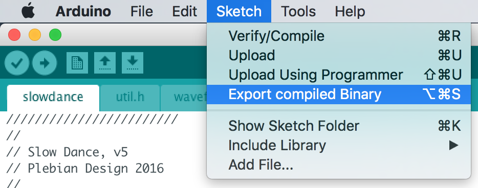
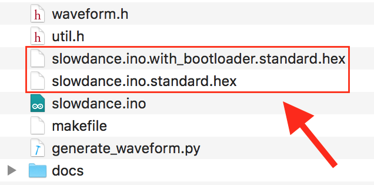

# Slow Dance Firmware

## Building

**Prerequisites**: Development was done with Arduino IDE version 1.8.0. It is recommended that this version be used for building the firmware, but a later version is likely to work as well.

### Step 1

Generate the electromagnet waveform data. The electromagnet is driven with a sine wave using [pulse density modulation](https://en.wikipedia.org/wiki/Pulse-density_modulation) so that it is quieter. The sinewave is stored in **waveform.h**, which is generated using the **generate_waveform.py** Python script.


### Step 2

Build the firmware using the "Sketch" -> "Export compiled Binary" option in the Arduino IDE. This should generate two files, **slowdance.ino.standard.hex** and **slowdance.ino.with_bootloader.standard.hex**. The latter contains the firmware along with the Arduino bootloader so that the Arduino software can be used to flash the device after the Slow Dance firmware is flashed.





## Flashing

[AVRDUDE](http://www.nongnu.org/avrdude/) can be used to flash the firmware to the ATmega328P in the Slow Dance hardware. Assuming a [USB Tiny ISP programmer](https://learn.adafruit.com/usbtinyisp) is used, the command is:

```
avrdude -c usbtiny -p atmega328p -U flash:w:slowdance.ino.with_bootloader.standard.hex -U lfuse:w:0xff:m -U hfuse:w:0xde:m -U efuse:w:0x05:m
```

